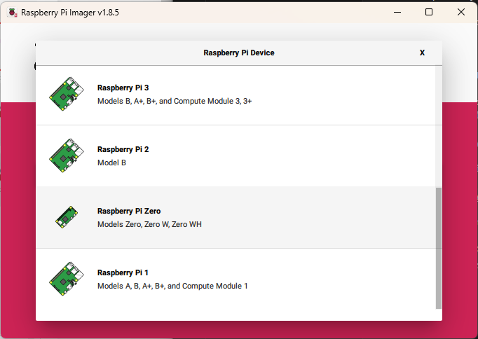
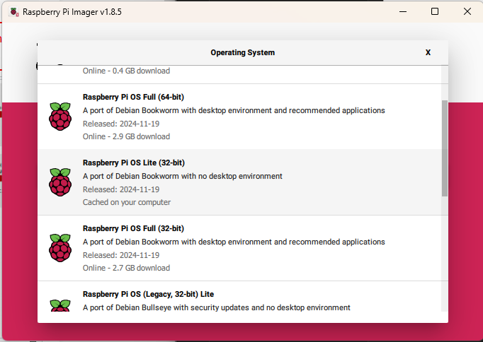
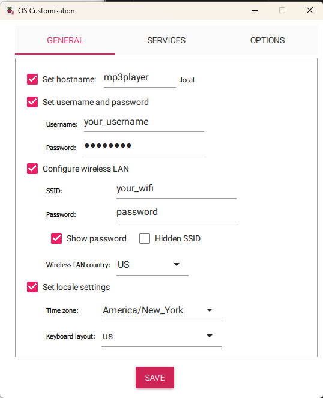
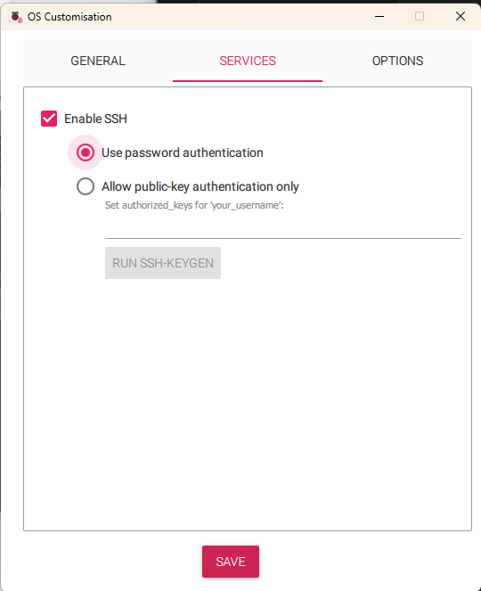

# MP3 Player Project

This project is making an MP3 Player using a Raspberry Pi, small LCD HAT, and Python to display, control, and queue music.

## Components Required

### This project requires:
* Rasperry Pi Zero W
* SD card
* 3.7V 1000mAh LiPo Battery
* [09362a Charging Module](https://www.amazon.com/Makerfocus-Charging-Lithium-Battery-Protection/dp/B071RG4YWM?crid=3MQENQADFEHB8&dib=eyJ2IjoiMSJ9.P9pcSpEsP9IiEy2NawRdycRvdLVuFOuK1_sy2PjlxXHnWhjJHfPQB2XHzFq-SD3cj3xl2AOt6oRp17gW94uAGV1g25Dpi1o2WI5Z0YGNQRDdCgzYOHuYqs_uqdHmwi3-bCih46-z1lASdtswEOl4Y-R4zfzo5-OQbe1DdIYqAOUbJUjoLVSBiyJYci9sK0dlOSEIn8MGBo3WevOOFyslRij7v8i3PtrkoZWdxGVkz26Gtq_h7bXg2U9RiJ0U9Ppl7Gih9Ro58T3H0q4bLTwhopcezE-k9w3eifp0L4mDn24.X0tEXDKNzYXwF_M9xvcqa6KKrHHStqUAANXtBFrypqk&dib_tag=se&keywords=03962a&qid=1739564144&sprefix=03962a%2Caps%2C94&sr=8-1&th=1)
* [3.7V-5V DC Converter](https://www.amazon.com/dp/B09D3G96KZ?ref=ppx_yo2ov_dt_b_fed_asin_title&th=1)
* [1.44inch LCD display HAT for Raspberry Pi](https://www.waveshare.com/1.44inch-lcd-hat.htm?amazon)
* 2-way switch

### You will need:
* Soldering iron
* Raspberry Pi Imager
* Capability to SSH into headless Raspberry Pi
  * Windows: Putty.exe or OpenSSH
  * MacOS and Linux: ssh through terminal
* 3D Printer for case


## Setup Instructions

These instructions will cover how to configure your Raspberry Pi Zero W for the 1.44in LCD HAT and bluetooth audio.

### Raspberry Pi OS download

The first thing you will need to do is flash an SD card with the Raspberry Pi Os Lite (32-bit) using the [Raspberry Pi Imager](https://www.raspberrypi.com/software/).

Make sure to choose the correct device (Raspberry Pi Zero W) by selecting "CHOOSE DEVICE" then scrolling down to Raspberry Pi Zero.



Then choose the Raspberry Pi OS Lite (32-bit) by selecting "CHOOSE OS", "Raspberry Pi OS (other)", then scrolling down to Raspberry Pi OS Lite (32-bit).



Then choose your SD card by selecting "CHOOSE STORAGE".

After choosing the device, OS, and storage, click "NEXT" and choose to edit settings. It will open a new window to configure your Raspberry Pi's settings so it can have its own hostname, username and password, and connect to your wifi.
> [!IMPORTANT]  
> REMEMBER THE HOSTNAME, USERNAME, AND PASSWORD YOU SET. These will be used later.
> 
>Make sure to set the Wireless LAN country to your country.  



> [!IMPORTANT]  
> Go to the services tab and make sure SSH is enabled with password authentication.



Once these settings are configured, save the settings and choose "YES" to if you want to use your custom settings. The imager will then begin to flash your SD card. This may take a while.

Once its done flashing, you take your SD card and put it in your Raspberry Pi and connect it to a power source. This is a headless setup, so there is no need to attach a monitor. The RPi will take a few minutes to initially set up the device, and once it is done you can SSH to it with your computer.

Open a terminal on your computer and type:
```
ssh [your_username]@[your_hostname].local
```
Make sure to replace [your_username] and [your_hostname] with the username and hostname you used when configuring your RPi settings.

### Setup for the 1.44in LCD HAT

These instructions are pulled from Waveshare's [demo instructions](https://www.waveshare.com/wiki/1.44inch_LCD_HAT#Demo) for the LCD HAT.

#### Enable SPI interface
```
sudo raspi-config
Choose Interfacing Options -> SPI -> Yes  to enable SPI interface
```
#### Reboot 
```
sudo reboot
```

You will be disconnected from your RPi and need to SSH back into it at this point.

#### Installing Libraries

* BCM2835
```
wget http://www.airspayce.com/mikem/bcm2835/bcm2835-1.71.tar.gz
tar zxvf bcm2835-1.71.tar.gz 
cd bcm2835-1.71/
sudo ./configure && sudo make && sudo make check && sudo make install
```
* WiringPi
```
cd
sudo apt-get install wiringpi
#For Raspberry Pi systems after May 2019 (earlier than that can be executed without), an upgrade may be required:
wget https://project-downloads.drogon.net/wiringpi-latest.deb
sudo dpkg -i wiringpi-latest.deb
gpio -v
# Run gpio -v and version 2.52 will appear, if it doesn't it means there was an installation error

cd
git clone https://github.com/WiringPi/WiringPi
cd WiringPi
. /build
gpio -v
# Run gpio -v and version 2.70 will appear, if it doesn't it means there was an installation error
```

* lgpio
```
cd
wget https://github.com/joan2937/lg/archive/master.zip
unzip master.zip
cd lg-master
sudo make install
```

* Python
```
sudo apt-get update
sudo apt-get install python3-pip
sudo apt-get install python3-pil
sudo apt-get install python3-numpy
sudo apt-get install python3-spidev
```

### Setup for Bluetooth Connections

These instructions are pulled from [Connecting a Bluetooth Headset to a Raspberry Pi Running OS Lite by Danny Staple](https://orionrobots.co.uk/2024/03/30/30-bluetooth-headset-on-pi.html#making-a-bluetooth-audio-helper).

#### Install bluetooth alsa tools:
```
sudo apt install bluez-alsa-utils
```

#### Making a bluetooth audio helper
Use this to create a helper file:
```
sudo nano /usr/bin/bluealsa-start-helper
```
And add this code to the file:
```
#!/bin/bash
hcitool cmd 0x3F 0x01C 0x01 0x02 0x00 0x01 0x01
/usr/bin/bluealsa -p a2dp-source -p a2dp-sink -p hfp-hf -p hsp-hs -p hfp-ag -p hsp-ag
```
Use Ctrl+X and Y to exit and save the file. Then make the file executable by with:
```
sudo chmod +x /usr/bin/bluealsa-start-helper
```
#### Update the bluealsa service to run the helper
```
sudo nano /lib/systemd/system/bluealsa.service
```
After opening this file, find the line that starts with ExecStart and replace it with this:
```
ExecStart=/usr/bin/bluealsa-start-helper
```
Use Ctrl+X and Y to exit and save the file. Next restart the bluetooth service:
```
sudo systemctl daemon-reload
sudo systemctl restart bluealsa
```

Now your RPi is set up to connect to bluetooth headphones.

### Setup for Audio Output

Install VLC onto your RPi:
```
sudo apt install vlc
```

#### Creating a VLC service to run on startup
* Create a unit file:

Make a VLC unit file:
```
sudo nano /lib/systemd/system/vlc.service
```
Add the following:
```
[Unit]
Description=VLC Service
After=multi-user.target

[Service]
Type=idle
User=[your_username]
EnvironmentFile=/etc/.vlcserviceconf
ExecStart=/usr/bin/vlc ${CLI} ${HOSTADDR}

[Install]
WantedBy=multi-user.target
```
> [!IMPORTANT]  
> Make sure to replace [your_username] with your username you used when configuring your RPi's settings

Save and exit.

* Create and environment file

Make an EnvironmentFile with:
```
sudo nano /etc/.vlcserviceconf
```
And add the following:
```
CLI=--cli-host
HOSTADDR=localhost:24680
```
Save and exit.

* Set the unit file permission

Set the vlc.service permission:
```
sudo chmod 644 /lib/systemd/system/sample.service
```

* Configure systemd
```
sudo systemctl daemon-reload
sudo systemctl enable vlc.service
sudo systemctl start vlc.service
sudo systemctl status vlc.service
```
The last line should output something like this:
```
● vlc.service - VLC Service
     Loaded: loaded (/lib/systemd/system/vlc.service; enabled; preset: enabled)
     Active: active (running) since [Day of Week] [YYYY-MM-DD] [HH:MM:SS] [Timezone]; [X]h ago
   Main PID: 361 (vlc)
      Tasks: 3 (limit: 387)
        CPU: 44.708s
     CGroup: /system.slice/vlc.service
             └─361 /usr/bin/vlc --cli-host localhost:24680
```
Now your VLC service will automatically start whenever the RPi turns on.

### Clone this Repository
```
cd
sudo apt install git
git clone https://github.com/tobi-deruiter/mp3player.git
```

